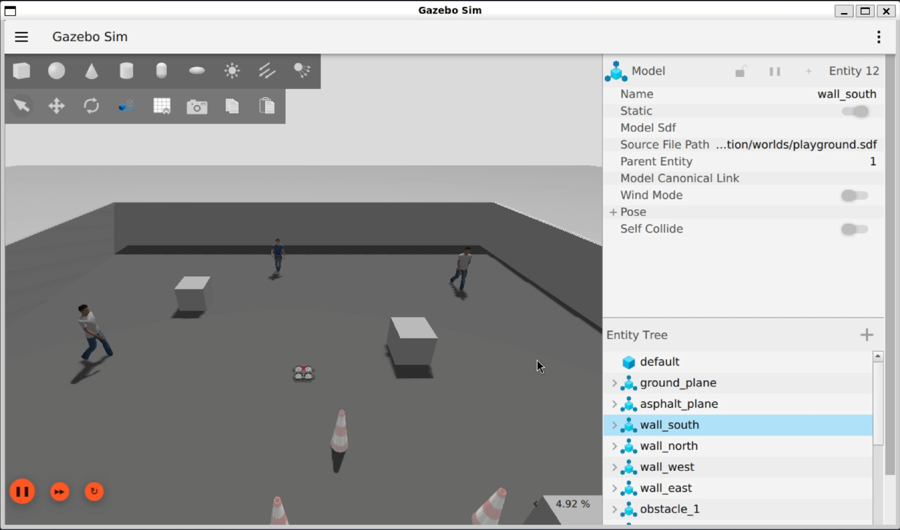

# Drone Sim — ROS 2 Quadrotor Simulation


> 🔒 Source code is under institutional NDA (NIT Rourkela internship project).
> This document covers architecture, implementation details, and design decisions.

A quadrotor simulation stack built on ROS 2 Jazzy and Gazebo Harmonic, featuring a Non-Linear Model Predictive Controller (NMPC) implemented in C++ using Acados (SQP-RTI via HPIPM) and a 5th-order Min-Jerk Trajectory Generator for autonomous waypoint tracking. Supports manual teleoperation and a full Planner-Tracker autonomy pipeline.

> Inspired by [sjtu_drone](https://github.com/NovoG93/sjtu_drone), reimplemented from scratch for the modern ROS 2 + Gazebo Sim stack.



---

## Tech Stack

| Component | Version |
|---|---|
| **OS** | Ubuntu 24.04 (WSL2 supported) |
| **ROS 2** | Jazzy Jalisco |
| **Simulator** | Gazebo Harmonic (gz-sim) |
| **Languages** | C++, Python 3 |
| **NMPC Solver** | Acados (SQP-RTI via HPIPM) |
| **Math Library** | Eigen3 |
| **Build System** | ament_cmake |

---

## Package Overview

| Package | Description |
|---|---|
| `drone_description` | Drone URDF/Xacro model, 3D meshes, Gazebo world, sensor & motor plugins |
| `drone_bringup` | Launch files, bridge configuration, and simulation startup |
| `drone_control` | **NMPC controller** (C++), Trajectory Generator, motor mixer, teleop keyboard node |
| `drone_gazebo` | Gazebo-specific configurations and extensions |

---

## Architecture

```
┌──────────────────────────────────────────────────────────────┐
│                      Gazebo Harmonic                         │
│                                                              │
│  ┌────────────┐  ┌─────────┐  ┌──────────────────────────┐   │
│  │ Playground │  │  Drone  │  │ MulticopterMotorModel ×4 │   │
│  │   World    │  │  Model  │  │   (per-rotor physics)    │   │
│  └────────────┘  └────┬────┘  └──────────┬───────────────┘   │
│                       │                  │                   │
│             Sensors   │     motor_speed  │                   │
│    (IMU,Cam,GPS,Alt)  │       (ω₁₋₄)     │                   │
└───────────────────────┼──────────────────┼───────────────────┘
                        │                  │
                ┌───────┴──────────────────┴───────┐
                │         ros_gz_bridge            │
                │        (Gazebo ↔ ROS 2)          │
                └───────┬──────────────────┬───────┘
                        │                  │
                    GZ_TO_ROS          ROS_TO_GZ
                        │                  │
          ┌─────────────┴────┐    ┌────────┴───────────────────┐
          │  /odom           │    │ /drone/gazebo/command/     │
          │  /imu            │    │        motor_speed         │
          │  /front/image    │    │  (actuator_msgs/Actuators) │
          │  /bottom/image   │    └────────┬───────────────────┘
          │  /navsat         │             │
          └──────────────────┘             │
                                           │
          ┌────────────────────────────────┴───────────────────┐
          │                  ROS 2 NMPC Stack                  │
          │                                                    │
          │   ┌───────────────┐        ┌───────────────────┐   │
          │   │  Trajectory   │        │ NMPC Controller   │   │
          │   │   Generator   ├───────→│ (C++ / Acados)    │   │
          │   │               │        │                   │   │
          │   └───────▲───────┘        └─────────▲─────────┘   │
          │           │                          │             │
          └───────────┼──────────────────────────┼─────────────┘
                      │                          │
                 /goal_pose                    /odom
```

### MPC Pipeline (Planner-Tracker)

```
/goal_pose ──→ TrajectoryGenerator ──→ /drone/trajectory ──→ NMPCSolver ──→ MotorMixer ──→ motor_speed
                                                                 ↑
                                                               /odom
```

---

## ROS 2 Topics

### Sensor Topics (Gazebo → ROS)

| Topic | Message Type | Rate | Description |
|---|---|---|---|
| `/odom` | `nav_msgs/Odometry` | 100 Hz | Ground-truth odometry (position, velocity, orientation) |
| `/imu` | `sensor_msgs/Imu` | 100 Hz | Orientation, angular velocity, linear acceleration |
| `/front/image_raw` | `sensor_msgs/Image` | 30 Hz | Front-facing RGB camera (640×360) |
| `/front/camera_info` | `sensor_msgs/CameraInfo` | 30 Hz | Front camera calibration |
| `/bottom/image_raw` | `sensor_msgs/Image` | 15 Hz | Downward-facing RGB camera (640×360) |
| `/bottom/camera_info` | `sensor_msgs/CameraInfo` | 15 Hz | Bottom camera calibration |
| `/navsat` | `sensor_msgs/NavSatFix` | 30 Hz | GPS coordinates (with Gaussian noise) |
| `/clock` | `rosgraph_msgs/Clock` | — | Simulation time |

### Command Topics (ROS → Gazebo)

| Topic | Message Type | Description |
|---|---|---|
| `/drone/gazebo/command/motor_speed` | `actuator_msgs/Actuators` | Direct motor speed commands [ω₀, ω₁, ω₂, ω₃] (rad/s) |

### Controller Topics

| Topic | Message Type | Direction | Description |
|---|---|---|---|
| `/goal_pose` | `geometry_msgs/PoseStamped` | Subscribe (Planner) | Target position + heading |
| `/drone/trajectory` | `trajectory_msgs/MultiDOFJointTrajectory` | Pub/Sub (Internal) | Min-jerk trajectory from Planner to NMPC |
| `/odom` | `nav_msgs/Odometry` | Subscribe (Both) | Current drone state |
| `/drone/gazebo/command/motor_speed` | `actuator_msgs/Actuators` | Publish (NMPC) | Computed motor commands |

### TF Frames

| Frame | Description |
|---|---|
| `odom` | World-fixed odometry frame |
| `base_footprint` | Root frame (ground projection) |
| `base_link` | Drone body center of mass |
| `front_cam_link` | Front camera optical frame |
| `bottom_cam_link` | Bottom camera optical frame |
| `sonar_link` | Sonar/altimeter frame |
| `rotor_0` — `rotor_3` | Propeller frames |

---

## Project Structure

```
drone_sim/
├── drone_description/
│   ├── meshes/
│   │   ├── quadrotor_4.dae             # Visual mesh (Collada)
│   │   └── quadrotor_4.stl             # Collision mesh
│   ├── urdf/
│   │   └── drone.urdf.xacro            # Robot description
│   └── worlds/
│       └── playground.sdf              # Simulation world
│
├── drone_bringup/
│   ├── config/
│   │   └── bridge_config.yaml          # ROS↔Gazebo bridge topics
│   └── launch/
│       └── drone_bringup.launch.py     # Main launch file
│
├── drone_control/
│   ├── c_generated_code/               # Acados generated C solver code
│   ├── include/drone_control/mpc/
│   │   ├── types.hpp                   # Data structures (State, Control, config)
│   │   ├── motor_mixer.hpp             # Thrust/torque → motor speeds
│   │   └── nmpc_controller.hpp         # Main Acados NMPC wrapper
│   ├── src/mpc/
│   │   ├── trajectory_generator_node.cpp # 5th-order Min-Jerk planner
│   │   ├── nmpc_controller.cpp         # NMPC state mapping and solving
│   │   └── mpc_controller_node.cpp     # ROS 2 tracking node entry point
│   ├── scripts/
│   │   └── acados/
│   │       ├── generate_nmpc.py        # Python script to generate the Acados OCP
│   │       └── quadrotor_model/        # CasADi symbolic quadrotor dynamics
│   ├── config/
│   │   └── mpc_params.yaml             # Tunable NMPC parameters
│   └── launch/
│       └── mpc_controller.launch.py
│
├── drone_gazebo/                       # Gazebo extensions (placeholder)
└── README.md
```

---

## Roadmap

- [x] Custom playground world
- [x] Drone URDF with meshes
- [x] Sensor simulation (IMU, cameras, GPS, altimeter)
- [x] Multicopter flight physics (MulticopterMotorModel)
- [x] ROS-Gazebo bridge
- [x] Keyboard teleoperation
- [x] Direct motor interface (bypass velocity controller)
- [x] NMPC Controller — C++ / Acados (Non-linear quadrotor model)
- [x] Motor mixer (thrust/torques → motor speeds)
- [x] NMPC tuning & hover testing
- [x] Trajectory tracking (5th-order Min-Jerk trajectory generator)

---

## Acknowledgments

- Inspired by [sjtu_drone](https://github.com/NovoG93/sjtu_drone) (ROS 2 Humble + Gazebo Classic)
- Built with [ROS 2 Jazzy](https://docs.ros.org/en/jazzy/) and [Gazebo Harmonic](https://gazebosim.org/)
- Nonlinear optimization powered by [Acados](https://docs.acados.org/) and CasADi
